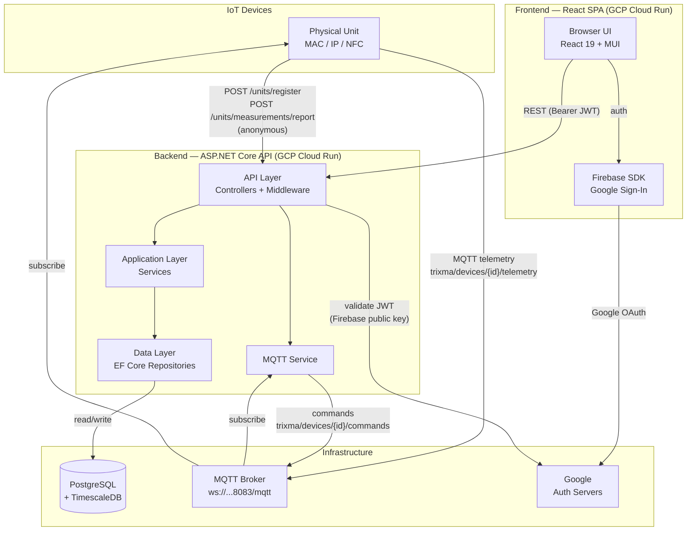

# Koa.Trixma — Living Specification

> Update this file as features are added, changed, or removed.
> Each item should reflect the **current state** of the codebase, not aspirational goals.

---

## Architecture Overview

---

## Current Status

**Phase:** Early development / MVP

---

## Implemented Features

### Authentication
- [x] `SPEC-101` Google Sign-In via Firebase (frontend)
- [x] `SPEC-102` JWT validation on backend (Firebase public key)
- [x] `SPEC-103` User sync middleware — Firebase user → DB user on first request
- [x] `SPEC-104` Protected routes in frontend (redirect to login if unauthenticated)

### Systems
- [x] `SPEC-201` Create, read, update, delete systems
- [x] `SPEC-202` Systems are scoped to the authenticated user (owner isolation)
- [x] `SPEC-203` Dashboard lists all systems with unit count
- [x] `SPEC-204` System detail view shows contained units

### Units (IoT Devices)
- [x] `SPEC-301` Create, read, update, delete units (authenticated)
- [x] `SPEC-302` Anonymous device self-registration (`POST /units/register`) — devices send MAC address + IP
- [x] `SPEC-303` Anonymous measurement reporting (`POST /units/measurements/report`)
- [x] `SPEC-304` Unit detail view with measurement charts

### Measurements
- [x] `SPEC-401` Time-series storage in TimescaleDB hypertable
- [x] `SPEC-402` Measurements grouped by type (e.g. temperature, humidity)
- [x] `SPEC-403` Date-range queries (from/to)
- [x] `SPEC-404` Recharts area charts in frontend
- [x] `SPEC-405` Time period selector: 24h, 1w, 1m, 3m, 6m, 1y

### Infrastructure
- [x] `SPEC-501` Frontend Dockerized (multi-stage: Vite build → nginx serve)
- [x] `SPEC-502` Runtime environment variable injection via `entrypoint.sh`
- [x] `SPEC-503` Pulumi IaC targeting GCP Cloud Run
- [x] `SPEC-504` nginx configured for SPA routing (fallback to index.html)

---

## Partially Implemented

### GraphQL
- [ ] `SPEC-601` Hot Chocolate is installed and referenced in the Data layer
- [ ] `SPEC-602` No resolvers or schema currently exposed
- [ ] `SPEC-603` Decision pending: keep REST-only, or add GraphQL for specific use cases (see ADR-002)

### MQTT
- [x] `SPEC-701` MQTTnet client initialized on backend startup
- [x] `SPEC-702` `MqttController` and `MqttService` exist
- [x] `SPEC-703` MQTT topics, message format, and device protocol defined (see ADR-004); bidirectional: device telemetry ingestion via `trixma/devices/{id}/telemetry`, commands via `trixma/devices/{id}/commands`
- [ ] `SPEC-704` No frontend integration for real-time updates

---

## Not Yet Implemented / Planned

> Move items to "Implemented" when done. Add rationale/notes where useful.

### Core
- [ ] `SPEC-801` Unit → System assignment flow (currently units must be created within a system, but device registration doesn't assign to a system automatically)
- [ ] `SPEC-802` NFC-based device identification (field exists on Unit but no flow implemented)
- [ ] `SPEC-803` Pagination for measurements (long date ranges can return large datasets)
- [ ] `SPEC-804` Unit/system sharing between users

### Frontend
- [ ] `SPEC-901` Real-time measurement updates (WebSocket or MQTT over WS)
- [ ] `SPEC-902` Measurement export (CSV / JSON)
- [ ] `SPEC-903` Unit management UI (currently limited — edit/delete from list, no dedicated management page)
- [ ] `SPEC-904` Error handling and user feedback improvements (toast notifications, retry logic)

### Backend
- [ ] `SPEC-1001` Rate limiting on anonymous endpoints (register + report)
- [ ] `SPEC-1002` Input validation beyond basic model binding
- [ ] `SPEC-1003` Soft deletes (currently hard deletes with cascade)
- [ ] `SPEC-1004` Audit log / history of changes

### Operations
- [ ] `SPEC-1101` Backend Dockerfile finalized for production
- [ ] `SPEC-1102` CI/CD pipeline
- [ ] `SPEC-1103` Staging environment
- [ ] `SPEC-1104` Monitoring / alerting

---

## Known Issues / Tech Debt

- `SPEC-TD01` CORS is fully open (`AllowAnyOrigin`) — needs to be restricted before production
- `SPEC-TD02` `appsettings.json` contains hardcoded local IPs — should be environment-specific config
- `SPEC-TD03` No unit or integration tests currently
- `SPEC-TD04` `.env` with Firebase credentials is likely checked in — should be in `.gitignore` / secrets management

---

## How to Update This File

When you implement a feature:
1. Move it from "Planned" to "Implemented" (add `[x]`)
2. Remove the item from "Not Yet Implemented"
3. If a design decision was made, add an ADR in `docs/adr/`

When you discover a problem or tech debt, add it to "Known Issues".
